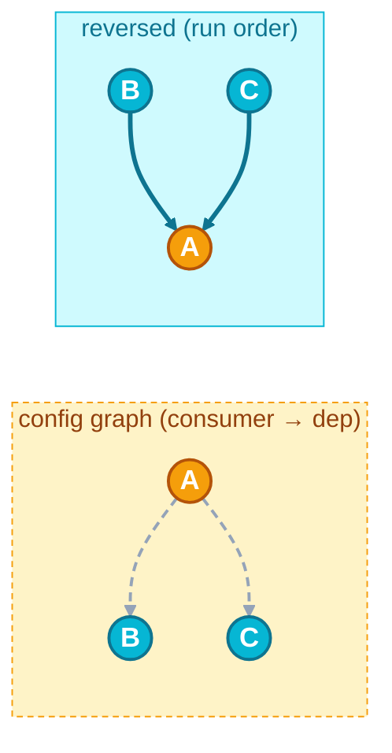
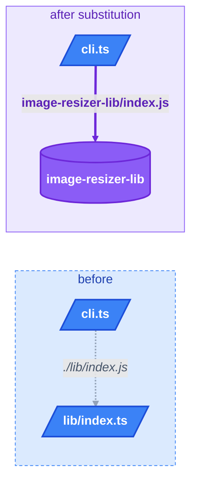
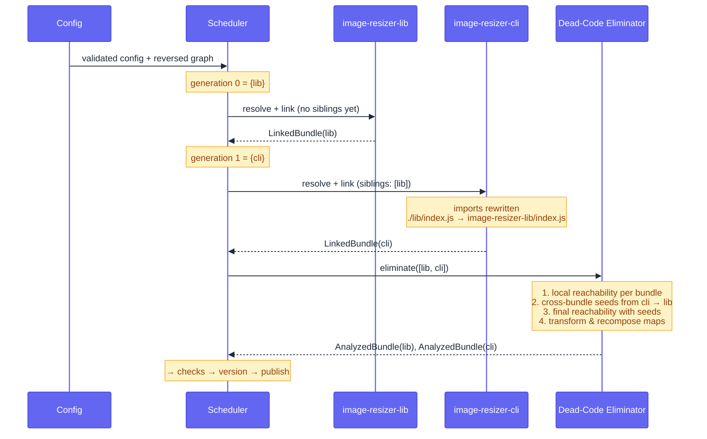

# How it works under the hood

This document explains the pipeline, the data structures, and the algorithms that drive bundling, dead-code elimination, import rewriting, automatic versioning, and parallel scheduling. It is written for engineers who want to contribute, debug, or simply understand the trade-offs — not for end users (read the [readme](../readme.md) for that).

## 1. The pipeline

A single `packtory publish` run is a chain of seven stages. Each stage produces an immutable artifact consumed by the next.

```mermaid
flowchart LR
    A([Config]) --> B[Validation +<br/>Package Graph]
    B --> C(Resource Resolver)
    C --> D(Linker)
    D ==> E[[Dead-Code Eliminator]]
    E --> F[[Checks]]
    F ==> G(Version Manager)
    G --> H([Bundle Emitter])

    subgraph PP1 ["per package"]
        C
        D
    end
    subgraph CP ["cross-package"]
        E
        F
    end
    subgraph PP2 ["per package"]
        G
        H
    end

    classDef input fill:#0ea5e9,stroke:#0369a1,stroke-width:2px,color:#fff,font-weight:bold
    classDef perPkg fill:#6366f1,stroke:#4338ca,stroke-width:2px,color:#fff,font-weight:bold
    classDef crossPkg fill:#ec4899,stroke:#be185d,stroke-width:2px,color:#fff,font-weight:bold
    classDef output fill:#10b981,stroke:#047857,stroke-width:2px,color:#fff,font-weight:bold

    class A,B input
    class C,D perPkg
    class E,F crossPkg
    class G,H output

    linkStyle 0,1,2 stroke:#6366f1,stroke-width:2px
    linkStyle 3 stroke:#ec4899,stroke-width:3px
    linkStyle 4 stroke:#ec4899,stroke-width:2px
    linkStyle 5 stroke:#10b981,stroke-width:3px
    linkStyle 6 stroke:#10b981,stroke-width:2px

    style PP1 fill:#eef2ff,stroke:#6366f1,stroke-width:1px,stroke-dasharray:4 3,color:#4338ca
    style CP fill:#fdf2f8,stroke:#ec4899,stroke-width:1px,stroke-dasharray:4 3,color:#be185d
    style PP2 fill:#ecfdf5,stroke:#10b981,stroke-width:1px,stroke-dasharray:4 3,color:#047857
```



The artifact names are not arbitrary; they form a type ladder:

| Stage                | Input                         | Output                        |
| -------------------- | ----------------------------- | ----------------------------- |
| Resource Resolver    | `ResourceResolveOptions`      | `ResolvedBundle`              |
| Linker               | `ResolvedBundle`              | `LinkedBundle`                |
| Dead-Code Eliminator | `LinkedBundle[]`              | `AnalyzedBundle[]`            |
| Checks               | `AnalyzedBundle[]`            | issues (string[])             |
| Version Manager      | `AnalyzedBundle`              | `VersionedBundleWithManifest` |
| Bundle Emitter       | `VersionedBundleWithManifest` | published tarball             |

Two stages — dead-code elimination and checks — operate on the full set of bundles together. Everything else runs per-package and is parallelised by the **scheduler** (§3).

## 2. The package graph

The user describes packages as a flat list with optional `bundleDependencies` / `bundlePeerDependencies`. Validation turns that list into a directed graph `G = (V, E)` where:

- $V$ = package names
- $(a, b) \in E$ iff package $a$ declares package $b$ as a bundle (peer-)dependency

Cycles are rejected at validation time. The graph is stored on the validated config and reused by both the scheduler and the linker.

## 3. The scheduler

The scheduler decides which packages can run in parallel without violating dependency order.

### Topological generations

For each generation we collect every package with in-degree 0, then "delete" them (decrement in-degree of their successors), and repeat until the graph is empty. The result is a partition of $V$:

$$
\text{generations}(G) = [V_0, V_1, \ldots, V_k] \quad \text{where} \quad V_i = \{ v \in V \setminus \bigcup_{j < i} V_j \mid \mathrm{indeg}(v, G_i) = 0 \}
$$

Packages in the same generation have no path between them and can be executed concurrently with `Promise.allSettled`. The implementation is `getTopologicalGenerations`.

### Why we reverse the graph first

The graph stored in the config has edges _from consumer to dependency_ (`A → B` means "A bundles B"). But the scheduler must run **dependencies before consumers**: it needs every `VersionedBundle` of `B` ready before `A` can rewrite its imports.

So before partitioning into generations, the scheduler calls `packageGraph.reverse()`. After reversal `B → A`, sources have in-degree 0, and they fall into generation 0.



### Cross-generation state

After every generation the scheduler appends the produced `LinkedBundle`s (or `VersionedBundle`s, depending on the phase) into a flat list and passes it to the next generation's `createOptions`. That list is what the linker uses to do import substitution (§5).

## 4. Stage: Resource Resolver — dependency scanning

Goal: starting from a package's entry-point files, find **every local source file reachable through `import` statements**, plus every `node_modules` import that needs to land in the generated `package.json`.

### Algorithm

```
scan(entryPoint, sourcesFolder):
    project ← create ts-morph Project rooted at sourcesFolder
    graph ← empty directed acyclic graph
    bfs(entryPoint):
        for each import literal L in current file:
            target ← ts.resolveModuleName(L, …)        # uses the host's tsconfig
            if target is inside /node_modules/:
                record external dependency
            else:
                add edge current → target, recurse
```

A few details worth highlighting:

- **Module resolution is delegated to TypeScript** (`ts.resolveModuleName`). This means packtory respects `tsconfig.json` `paths`, conditional exports, ESM resolution rules, and `.js`-extension imports of `.ts` files — for free.
- **Node built-ins** (`node:fs`, etc.) are silently ignored. Anything else that fails to resolve throws.
- The external-dependency extractor uses a small regex to pull the package name out of a `node_modules/…` path, with care for scoped packages (`@scope/name`).
- The graph is flattened with a breadth-first walk into the `DependencyFiles` shape that downstream stages consume.

### Source maps and declarations

If `includeSourceMapFiles: true`, the scanner also locates the paired `.map` for every code file (`source-map-file-locator.ts`) and adds it to the graph as a leaf. If an entry point declares a `.d.ts`, a _second_ scan is performed with `resolveDeclarationFiles: true` so the type graph is captured alongside the JavaScript graph.

## 5. Stage: Linker — import path rewriting

This is where packtory turns "monorepo with relative imports" into "npm package that references its siblings by name".

### What gets rewritten

Given the current bundle's resource graph and the already-built `LinkedBundle`s of its sibling packages, the linker looks at every direct dependency edge and asks:

> _Is the file on the other end owned by some sibling bundle?_

If yes, the import is replaced. The path becomes `<siblingName>/<targetFilePath>`. The matched source file is removed from the current bundle's graph (it'll be shipped by the sibling), and the sibling name is recorded as a `bundleDependency`.



### How the rewrite actually happens

We do _not_ do regex on the source. The path replacement runs through ts-morph: every `ImportStringLiteral` is resolved with `ts.resolveModuleName`, compared against the replacement map, and rewritten via `literal.setLiteralValue(...)`. This preserves whitespace, quote style, and trailing commas exactly. A small caveat applies to `.d.ts` imports — the basename of the original specifier is preserved in case the consumer relies on it.

### Why the order matters

The scheduler runs dependencies _before_ consumers (§3) precisely so that when the linker reaches package `A`, every sibling it might reference is already a fully-built `LinkedBundle` with stable `targetFilePath`s. There is no two-pass resolution.

## 6. Stage: Dead-Code Eliminator (tree-shaking, in plain language)

This is the most subtle stage. The goal is to drop every top-level declaration that nothing reaches, so the published package ships only what consumers actually use.

### The intuition first

A modern JavaScript bundle is a graph where:

- **Nodes** are _top-level bindings_: a function, class, type, enum, variable, or named import declared at the top of a file.
- **Edges** go from a binding to every other binding it references in its own body.
- **Roots** are the bindings that are _exported from public root files_ — these are the things consumers can actually import.

If you start at the roots and walk all edges, every binding you visit is _reachable_. Everything else is dead, and packtory deletes it.

This is the same idea every bundler uses; the part that differs is **how you decide what is a root** and **how strict you are about side effects**.

### Step 1 — Extract bindings

For every code file in the bundle, packtory walks the top-level statements and records one `BindingDescriptor` per declared name. Combined declarations like `const a = 1, b = 2;` produce two descriptors so they can be removed independently.

Each binding gets an id: `bindingId = "<filePath>::<name>"`.

### Step 2 — Find the roots (seeds)

Three kinds of seeds are added to a set $S$:

1. Every exported binding in any public root file. These are what consumers can `import`.
2. Every binding referenced by an **impure top-level statement** (anywhere in the bundle). Impure top-level code runs unconditionally on import, so anything it touches is live by definition. The classifier is described in §6.5.
3. **Cross-bundle seeds** — bindings that another packtory-managed bundle actually consumes. Without this, exports that exist _only_ for sibling packages would look dead and be deleted. See §6.4.

### Step 3 — Breadth-first closure

Reachability is then a plain breadth-first closure over the binding graph:

$$
R = \mathrm{closure}(S, \mathrm{neighbors}) \quad \text{where} \quad \mathrm{neighbors}(b) = \{ b' \mid b' \text{ is referenced inside the body of } b \}
$$

The neighbour relation is computed by walking every `Identifier` inside the binding's declaration node and resolving its `Symbol` via the TypeScript compiler. Two consequences:

- **Shadowing works correctly**: an inner `const foo = 1` shadows an outer `foo`, and the compiler tells us so. Naïve text matching would get this wrong.
- **Import aliases follow through**: `import { x as y }` is tracked back to the original export.

Implementation: `bfsClosure`.

### Step 4 — Remove what survives

For every file, the analyzer computes:

```
shouldTransform  = transformationsEnabled ∧ fileHasNoSideEffects
survivingNames   = shouldTransform ? reachable ∩ fileBindings : fileBindings
```

If a file has any impure top-level statement, **packtory keeps the file as-is**. Removing declarations from a file that runs side effects could change those side effects' meaning, so the conservative choice is to leave it alone.

For pure files, the declaration remover walks top-level statements, captures the byte ranges of survivors (`PositionAtom`s), and removes the rest via ts-morph. Combined declarations are split so each declarator can be removed independently.

### 6.4 Cross-bundle seeding

This is the algorithm that prevents packtory from accidentally deleting exports that _only_ siblings depend on.

For every package `P` being built, and every code file `F` in `P`, we look at `F`'s `import`/`export … from` statements. If the module specifier looks like `<siblingName>/<targetPath>` (i.e. the linker has already rewritten it in §5), we resolve the target file inside the sibling bundle and seed:

| Statement form                         | Seeded binding(s) in sibling |
| -------------------------------------- | ---------------------------- |
| `import x from 'pkg/f.js'`             | _every_ binding in `f.js`    |
| `import { a, b as c } from 'pkg/f.js'` | _every_ binding in `f.js`    |
| `import * as ns from 'pkg/f.js'`       | _every_ binding in `f.js`    |
| `export { a } from 'pkg/f.js'`         | _every_ binding in `f.js`    |
| `export * from 'pkg/f.js'`             | _every_ binding in `f.js`    |

**Gating on local reachability.** A cross-bundle `import` only seeds the sibling if at least one local binding it produces is itself reachable in the consuming bundle. Once that happens, packtory keeps the sibling's whole public file live so the generated `exports` surface stays coherent. Purely unreachable imports are not propagated.

The whole exchange happens in two phases:

1. Per-bundle: compute `localReachable` (Step 3 above, ignoring cross-bundle seeds).
2. Cross-bundle: walk every bundle's imports, produce a `Map<bundleName, Set<bindingId>>` of external seeds, then recompute reachability for each bundle by adding those seeds.

### 6.5 The side-effect classifier

The classifier is what makes the difference between a file packtory will tree-shake and a file it will leave intact. It looks at every top-level statement and asks "could this run code on import?". A statement is impure iff it matches one of:

- An expression statement: `console.log(...)`, `Object.freeze(...)`, IIFEs.
- A top-level `await`.
- A class declaration with decorators, static blocks, or impure static initializers.
- A control-flow statement (`if`, `for`, `while`, `try`, `switch`, …).
- A variable declarator whose initializer contains a call or property access (so `const x = 1 + 2` is pure; `const x = compute()` is not).
- A bare import of a `.css` file (e.g. `import './styles.css';`). CSS is the one asset format on a standards track (Import Attributes / CSS module type), so it gets explicit handling; other formats like `.scss`, `.less`, or images are bundler-only conventions and packtory makes no attempt to recognise them.
- Any statement kind the classifier doesn't recognise (fail-closed).

Pure-leaf expressions are: literals, identifiers, function/arrow/class expressions, certain unary/binary operators, plus parenthesised, `as`, `satisfies`, `!`, and `<T>` wrappers. Object and array literals are pure iff their elements are.

The same classifier serves three purposes:

1. **Gating tree-shaking** per file (above).
2. **Generating the `sideEffects` field** of the published manifest (`computeSideEffectsField`):
    - All files pure → `"sideEffects": false`
    - Some files impure → `"sideEffects": ["./impure.js", ...]` (sorted)
    - All files impure → omit the field
3. **The opt-in `noSideEffects` check**, which fails the build on any impure file not on an allow-list.

A user-provided `sideEffects` in `additionalPackageJsonAttributes` always wins.

### 6.6 Source-map recomposition

When a `.map` file is paired with a code file the analyzer transformed, packtory rebuilds the map so the published version still maps back to the _original_ sources at the new line/column positions.

<details>
<summary>The algorithm</summary>

```
recomposeSourceMap(originalMap, originalCode, transformedCode, atoms):
    trace ← TraceMap(originalMap)
    origIdx ← line-column index over originalCode
    newIdx  ← line-column index over transformedCode
    gen ← new GenMapping()
    for each (genLine, genCol, src, origLine, origCol) in trace:
        oldOffset ← lineColumnToOffset(origIdx, genLine, genCol)
        newOffset ← translateGeneratedOffset(oldOffset, atoms)
        if newOffset is undefined:        # the position was deleted
            skip
        newPos ← offsetToLineColumn(newIdx, newOffset)
        addMapping(gen, generated=newPos, source=src, original=(origLine, origCol))
    return JSON with re-encoded mappings
```

`PositionAtom`s describe the surviving byte ranges from the removal pass: `(originalStart, originalEnd, newStart)`. `translateGeneratedOffset` is a binary search over those atoms.

Malformed source maps are passed through unchanged rather than dropped. Files with no `.map` are a no-op.

</details>

## 7. Stage: Checks

After dead-code elimination, the full set of `AnalyzedBundle`s is fed through the configured check rules. Each rule is a pure function `(bundles, settings) → issues[]`. Every check is opt-in. They are documented end-to-end in the [readme](../readme.md#checks); the interesting architectural points are:

- Checks see the bundles **after dead-code elimination**, so e.g. `noUnusedBundleDependencies` correctly reports a `bundleDependencies` entry whose imports have been tree-shaken away.
- Rules are independent and run in arbitrary order; failures are aggregated into a single error.

## 8. Stage: Version Manager

Per bundle, the version manager produces a `VersionedBundle` and a `package.json`.

### Dependency distribution

This is the step that decides what ends up in `dependencies` vs `peerDependencies`. There are two sources of dependencies:

1. **Sibling bundles** that the linker substituted. For each, look up whether the user declared the sibling under `bundleDependencies` (→ `dependencies`) or `bundlePeerDependencies` (→ `peerDependencies`), then pin to the sibling's current version.
2. **External `node_modules` imports** seen during scanning. For each, look the name up in `mainPackageJson` and copy the version range from whichever of `dependencies` / `peerDependencies` declared it (peer wins).

### Specifier classification — refusing to ship junk

Before accepting an external dependency's version, packtory passes it through `npm-package-arg` and classifies the result:

| Specifier example                             | Classification             | Behaviour                           |
| --------------------------------------------- | -------------------------- | ----------------------------------- |
| `^1.2.3`, `1.x`, `latest`, `npm:alias@1.0.0`  | `registry`                 | accepted                            |
| `file:./foo.tgz`, `link:../lib`, `./relative` | `mutable` (file/directory) | rejected unless allow-listed        |
| `git+ssh://…`, `https://…/foo.tgz`            | `mutable` (git/remote)     | rejected unless allow-listed        |
| `workspace:*`, `portal:./x`                   | `malformed`                | always rejected with a clear reason |

The rationale: a published package whose `dependencies` point at a `workspace:*` or `file:` specifier will install fine on the author's machine and break for everyone else. `allowMutableSpecifiers` exists for the rare legitimate case (vendored fork pointing at a tag).

### Manifest assembly

`buildPackageManifest` composes the final `package.json` in this order: user-provided `additionalAttributes` first, then the auto-emitted `sideEffects` field (only if the user didn't provide one), then the _non-overridable_ identity fields (`name`, `version`, `main`, `type`, `dependencies`, `peerDependencies`, `types`). The serializer emits keys in a deterministic order so byte-identical runs produce byte-identical manifests — which matters for automatic versioning (§9).

## 9. Stage: Bundle Emitter — automatic version detection

In _manual_ versioning, the configured version is used verbatim. In _automatic_ mode, packtory decides for itself whether to bump.

### The algorithm

```
automaticPublish(bundle):
    latest ← registry.fetchLatestVersion(bundle.name)
    if latest is Nothing:
        publish bundle at minimumVersion (default 0.0.1)
        return
    candidate ← versionManager.addVersion(bundle, version=latest.version)
    tarball   ← registry.fetchTarball(latest.tarballUrl)
    remoteFiles ← extractPackageTarball(tarball)
    if compareFileDescriptions(candidate.files, remoteFiles) is equal:
        return # already-published
    publish versionManager.increaseVersion(candidate)  # patch bump
```

Key properties:

- **Byte-identical comparison.** `compareFileDescriptions` sorts both file lists by `filePath` and checks every file for equality. The `package.json` produced by the serializer is deterministic, so a no-op rebuild yields a no-op publish.
- **Only patch bumps.** packtory's worldview is "every release could be breaking anyway, so semver minor/major distinctions are noise". The argument: with enough consumers, every observable behaviour — an error message string, log ordering, the shape of a thrown object, even timing — becomes load-bearing for someone (Hyrum's Law). The author's intended public contract and consumers' actual contract are different sets, so a "patch" by the author can be a breaking change for a consumer, and the major/minor/patch trichotomy is a fiction in practice. This drastically simplifies the algorithm: there is exactly one operation, `semver.inc(v, 'patch')`.

    [](https://xkcd.com/1172/)
    <sub>_xkcd 1172, "Workflow" — every change breaks somebody's workflow, so pretending otherwise just hides the risk behind a bump-level._</sub>

- **The tarball is the source of truth.** packtory does _not_ trust the registry's metadata (size, shasum). It downloads and unpacks, then compares contents. This catches "I republished the same version after editing a file" anomalies that show up in some registries.

### Provenance and OIDC

If `publishSettings.access === 'public'` and `provenance.type === 'auto'`, the emitter asserts that the CI environment's repository URL matches `package.json#repository.url` _before_ publishing (`assertRepositoryCoherence`), then delegates the actual sigstore signing to `libnpmpublish`. The npm trusted-publishing token exchange is a separate OIDC resolver. Neither is on the hot path for this doc; see [supply-chain.md](./supply-chain.md) for the full story.

## 10. Putting it all together

A worked example: `image-resizer-cli` bundles `image-resizer-lib`.


